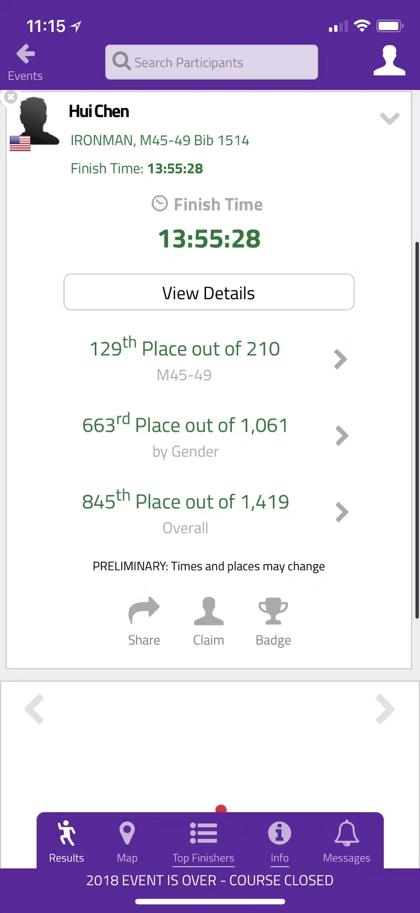

# 赛前
吃了安眠药的我，早上3点半被闹钟叫醒。猫哥猫嫂已经在准备早餐了。猫哥正在电磁炉上炒肉肠蛋炒饭，鸡蛋是上周猫嫂从她表姐夫家农场带回来的新鲜鸡蛋。我吃了两小碗再加上缪兄带来的在旺旺超市买的菜肉包子。因为离比赛开始的7点还有3个小时，我们都吃得饱饱的。一切收拾好以后，我们把跑步用的头灯和外套放到running special gear的口袋交给缪嫂，她还要开车把这几个口袋带到终点，这些东西是为了在晚上跑马拉松准备的。缪嫂因为担心开车迷路，早早就出发了。

四点半左右，猫哥开车装着3个不同年龄组，不同性别的选手出发了。我是男子45到49年龄组，缪哥55到59年龄组，猫嫂女子60到64年龄组。一路顺利，快到起点时来参赛的车子有点多起来，车灯在蜿蜒的山路忽隐忽现。猫哥把我们在离起点很近的地方放下来，他继续把车开到不远处的停车场。早晨5点，一轮淡金黄色的月牙儿悬在山坡，赛场已经开始逐渐热闹起来。我们一起排队让义工在手臂上写上参赛号码，在小腿上写上年龄。进入停放自行车的第一换项区时，猫哥已经把车停好拿着打气筒过来了， 我们给脚踏车打了气，排队上厕所。偶遇了几个人。

| 人物  | 描述 |
| ------------- | ------------- |
| Ethan Gui  | 他是我们熊猫组的蚊子/小师弟的朋友，实力很强，小师弟推荐我看过他写的详细的铁三比赛报告 [Ironman Vineman 2016 Race Report](https://medium.com/@ethangui/ironman-vineman-2016-race-report-47f9957fd0c4),  写得非常详尽专业。  |
|Warren|是猫哥认识的一位78岁还在打铁的神人，这次还准备冲击Kona 铁三世锦赛。后来听说种种原因没能完赛。|
|麦子和他的朋友|这次比赛国内来了不少选手，最近三项运动在国内也逐渐普及，但目前还没有Full Ironman的比赛。麦子他们是从苏州过来的。缪哥也是苏州人，在这里遇到老乡，有点小激动。|

6点左右我们到帐篷里换上游泳的胶衣，这次听从猫哥的建议，骑车跑步都没有穿三项专用的衣服,都是平时骑车和跑步用的。我们把换下来的衣服交给了猫哥。最后补充了一下能量，大家吃了一个菜肉包子。很管用。

# 游泳
6点20分左右开始到游泳的起点，这个起点是平时放船下水的一个小码头，各人根据自己的预测完成时间站在不同的地方，分批下水。游得快的先下，慢的后下，以避免不必要的冲撞。
6点半左右唱国歌，比赛组委会的人给大家鼓气。在这里碰到几位中国人，一位是在普渡大学读书的，还有他的从深圳给他来助威的大学同学。
一声炮响，6点40分开始下水。我们站在1:30-1:40游赛组，7点下水。水温大约65华氏度，比较舒服。

游泳是我比较有信心的一项。基本按照每10次划水抬头望一次风，第一圈应该游得挺直的。

游完第一圈出水的时候看了一下表，花了43分钟，应该是我平时训练的水平。但是距离只有1200 yard，觉得不对呀，使劲想了想，原来上周六模拟三项的时候把游泳设在了游泳池模式了，忘了改过来。

第二圈时，太阳的角度和湖面的水汽有点影响看方向，刚开始一段游得很偏，还好有在皮划艇上巡逻的义工提醒，纠正了方向。
游到一半有点尿急，思想斗争了一会儿，尿还是不尿。虽然运动员手册里没写不能尿，还是有点犹豫。想到可以省去待会儿上岸后上厕所的几分钟，还是决定放水。不试不知道，试了才发现在边游边尿很难。因为身体是平的，缺少重力的帮助。最后涓涓细流，缓缓弥漫开来，有点暖意。

游泳2.4英里，花了1小时30分，如果不游歪，可能会快一点。因为表没设好，也不知道到底游了多少。

# 骑车
游完就上岸了，看到猫哥在我拍照。边走边把胶衣的拉链拉下，到了扒衣队的地方，往地上一躺，义工非常麻利地把胶衣扒了。穿着一条三角泳裤走到换项区，稍微有点冷。拿好衣服，在帐篷里换好eBay的骑车服，抹了防嗮霜。喝了点水，一出帐篷，又被义工拉着抹了一遍。

骑车也算顺利，因为知道一路有补给站，这次自己没带水。稍微有点失误，因为第一个补给站在20英里开外，骑到后来有点快熬不住了。后来在每个补给站停一下，喝水，该上厕所上厕所，吃点香蕉。骑到下午1，2点的时候稍微有点热，不过也是特别晒。

一路上看到有几个选手在路边补胎；在大概5，6十英里的地方，有位选手转弯时摔倒了，好像伤得不轻，有几辆救护车；我也在一个转弯处速度没有降下来，差点撞上停在路上的车子。

好像在快到70英里的地方，我看了一下时间只有下午1点，算了一下，按照这个速度，大约下午四点左右能骑完。接下去的马拉松再慢8小时一定能跑下来，看来完赛应该没问题了。心里稍稍松了口气。
但最后的30英里骑得蛮辛苦，因为是顶风，不知道是风吹的，还是没有及时补充电解质的缘故，头也开始有点疼起来。快到换项区的时候，状态掉到了低谷。

骑车112英里，用时7小时3分。

# 跑步
进入换项区，义工把自行车推走，好几个选手都匆匆从我身边走过，我一个人自言自语，慢慢地去取了跑步用的包。头疼的越发厉害了，进了帐篷，一屁股坐在椅子上，缓了口气，先是问义工有没有止痛片，被告知要到外面的医疗帐篷拿。安慰我说，可能是盐分不够，出去喝点运动饮料就可以了。

把骑车服以尽可能慢的动作脱了下来，准备穿压缩袜，一弯腰，突然右大腿内侧有抽筋的感觉，站起来揉了几下试着蹲下去时又觉得有点疼。索性坐在椅子上歇一会，正好有几位从日本来参赛的选手，在骑车段聊过几句，他们刚骑完车，就和他们聊了一会儿天。大概过了10分钟，抽筋的症状基本消失，换好衣服，走出了帐篷。外面阳光灿烂，有不少来为朋友家人加油的观众拍手鼓励，突然精神一振，可能是所谓的鸡血效应。好像头也不疼了，忘了到医疗帐篷拿止痛片。

周五问猫哥跑步策略的时候，猫哥说尽量保持匀速运动。因为根据物理学，匀速运动消耗能量最少。这个马拉松完全按照这个策略执行，水站喝水，拿能量棒也没有停下来。更神奇的是将近五个小时，没有上厕所。

在跑第二圈的时候追上了缪哥，一起边聊边跑了大约0.5英里。缪嫂，猫哥也已经赶来助威，拍照了。问了猫哥猫嫂的情况，得知她也骑完车了。心里非常高兴。

第三圈的时候天开始暗下来，有点凉意，取到了头灯和外套。跑得也越来越高兴，很多选手开始走路，我依然保持着匀速，脸上堆满笑意，时不时和观众击掌。

跑步26.2英里，用时4小时42分。

# 官方成绩：

# 链接

[IMSR 2018 on Youtube](https://www.youtube.com/watch?v=sRzTtMHxqJ0&feature=share)

[IMSR 2018 on One Drive](https://1drv.ms/v/s!ArLIkNQh172vgpIWsVqj159Q3OPm-Q)
